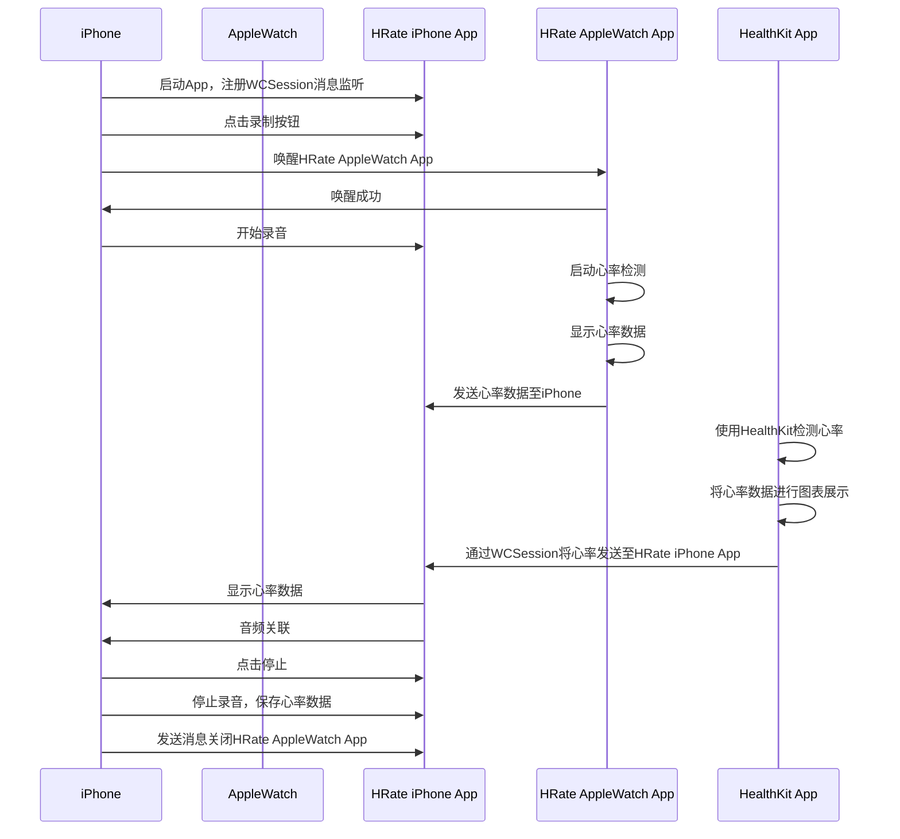

# HRate 将心率与录音关联起来
  

   https://user-images.githubusercontent.com/47659827/231647479-57ce7081-b2bf-46d9-bf0b-5cd96db1fe51.mp4

   https://user-images.githubusercontent.com/47659827/232798250-2feef93f-3d02-4529-8d36-d67d2d6d94a3.mp4

   https://user-images.githubusercontent.com/47659827/233249231-0db2812c-e6d0-41ca-887c-4b511480cd33.mp4

## 项目背景和动机
HRate 应用旨在帮助用户通过实时监测心率并将其与音频记录关联，以便用户在运动、工作或其他场景下了解自己的心率变化。

## 功能和特点
- 跨设备支持：通过 iPhone 和 Apple Watch 实现心率监测与音频记录的同步。
- 实时心率展示：在 Apple Watch 和 iPhone 上实时显示心率数据。
- 音频关联：将心率数据与音频记录关联，方便用户回顾和分析。
- 数据可视化：利用图表展示心率数据，帮助用户更直观地了解心率变化。

## 技术栈
- 使用 Swift 编程语言进行开发。
- 利用 Apple Watch 和 iPhone 的 WatchConnectivity 框架实现设备间通信。
- 通过 HealthKit 框架获取和展示心率数据。

## 系统要求
- iPhone 设备需运行 iOS 13 或更高版本。
- Apple Watch 设备需运行 watchOS 5 或更高版本。

  
### 引用

- [KDCircularProgress: 圆形进度指示器](https://github.com/kaandedeoglu/KDCircularProgress)
- [Charts: 交互式美观的图表库](https://github.com/danielgindi/Charts) 
- [SnapKit: Swift Auto Layout 约束库](https://github.com/SnapKit/SnapKit)
- [WCDBSwift: 腾讯的高性能数据库框架](https://github.com/Tencent/wcdb/tree/master/swift)
- [RxSwift: Swift 响应式编程框架](https://github.com/ReactiveX/RxSwift)
- [RxCocoa: 基于 RxSwift 的 Cocoa 和 Cocoa Touch 框架扩展](https://github.com/ReactiveX/RxSwift/tree/main/RxCocoa)
- [Zip: Swift 文件压缩与解压缩库](https://github.com/marmelroy/Zip) 
- [SSLineChart: 简单易用的折线图表库](https://github.com/luojh/SSLineChart)

