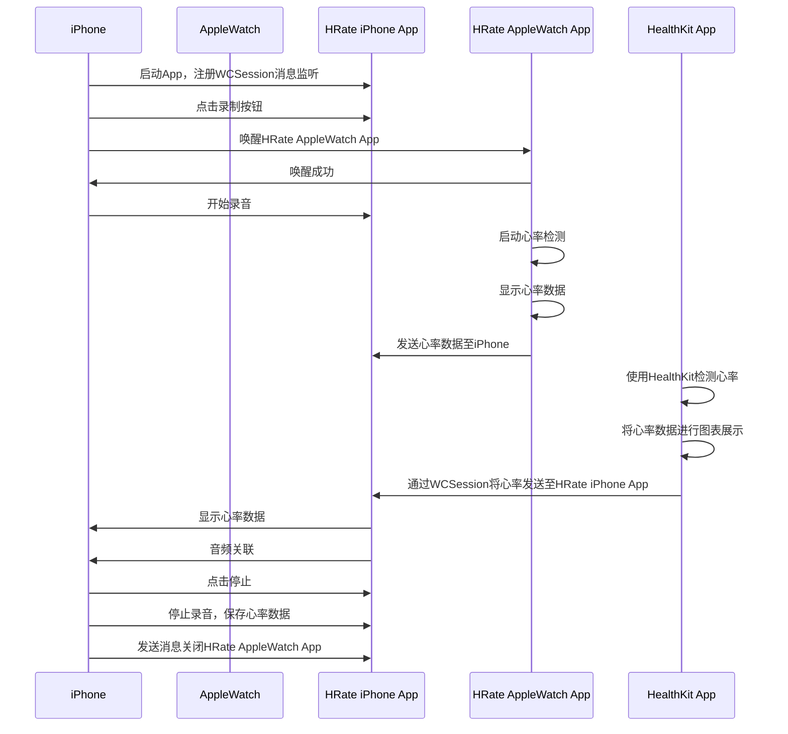

# HeartRate 将心率与录音关联起来
  

   https://user-images.githubusercontent.com/47659827/231647479-57ce7081-b2bf-46d9-bf0b-5cd96db1fe51.mp4

   https://user-images.githubusercontent.com/47659827/232798250-2feef93f-3d02-4529-8d36-d67d2d6d94a3.mp4

### 简述

1. **APP与watch通信**  
   1.1. WatchConnector初始化 (基于WCSession)  
   1.2. 使用WCSession sendMessage进行实时通信：（通过iPhone唤醒watchApp计算心率）  
   1.3. 使用WCSession transferUserInfo进行后台传输  （iPhone处理watchApp发送的心率日期数据）  
  
2. **数据源流向**  
   2.1. watch检测到心率数据并通过WatchConnector传递给APP  
   2.2. APP接收到心率数据 BPMTracker负责心率计算  
   2.3. BPMViewModel对录音数据及心率数据进行关联  
   2.4. BPMViewModel对录音数据进行处理并展示意到柱状图，心率数据显示  
   2.5. 支持导出json及关联音频的压缩包
  
3. **验证场景**  
   3.1. 室内单车团课，使用心率数据及对应录制的音频进行回放，记录生活  

  
### 引用

- [KDCircularProgress](https://github.com/kaandedeoglu/KDCircularProgress)
- [Charts](https://github.com/danielgindi/Charts) 
- [SnapKit](https://github.com/SnapKit/SnapKit)
- [WCDBSwift](https://github.com/Tencent/wcdb/tree/master/swift)
- [RxSwift](https://github.com/ReactiveX/RxSwift)
- [RxCocoa](https://github.com/ReactiveX/RxSwift/tree/main/RxCocoa)
- [Zip](https://github.com/marmelroy/Zip) 

